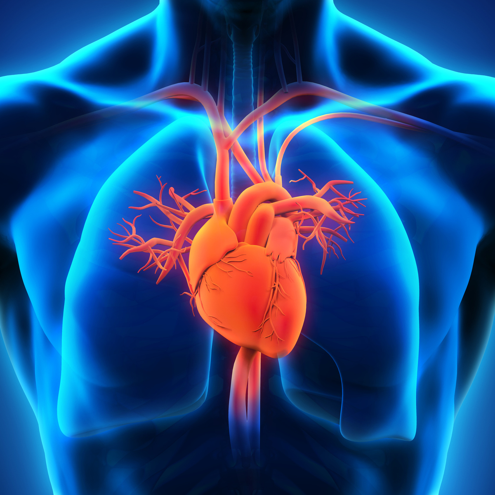

# Streamlit App for Heart Failure Prediction

## Project Intro/Objective
The purpose of this project is to create a streamlit app to help predict the presence of heart disease.

### Partners
Ansam Zedan * Silvana Brunner * Nithusya Mohanadasan * Jimena Batschelet

### Methods Used
* Exploratory Data Analysis 
* Supervised Machine Learning
* Deep Learning
* Data Visualization
* Predictive Modeling
* Model Interpretation Model

### Technologies

* Python
* Pandas, jupyter
* plotly
* matplotlib
* seaborn
* Sklearn
* keras
* shap

## Project Description
TODO

